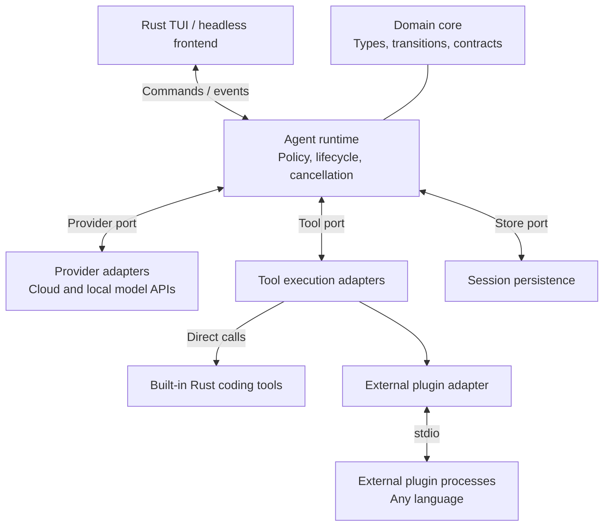
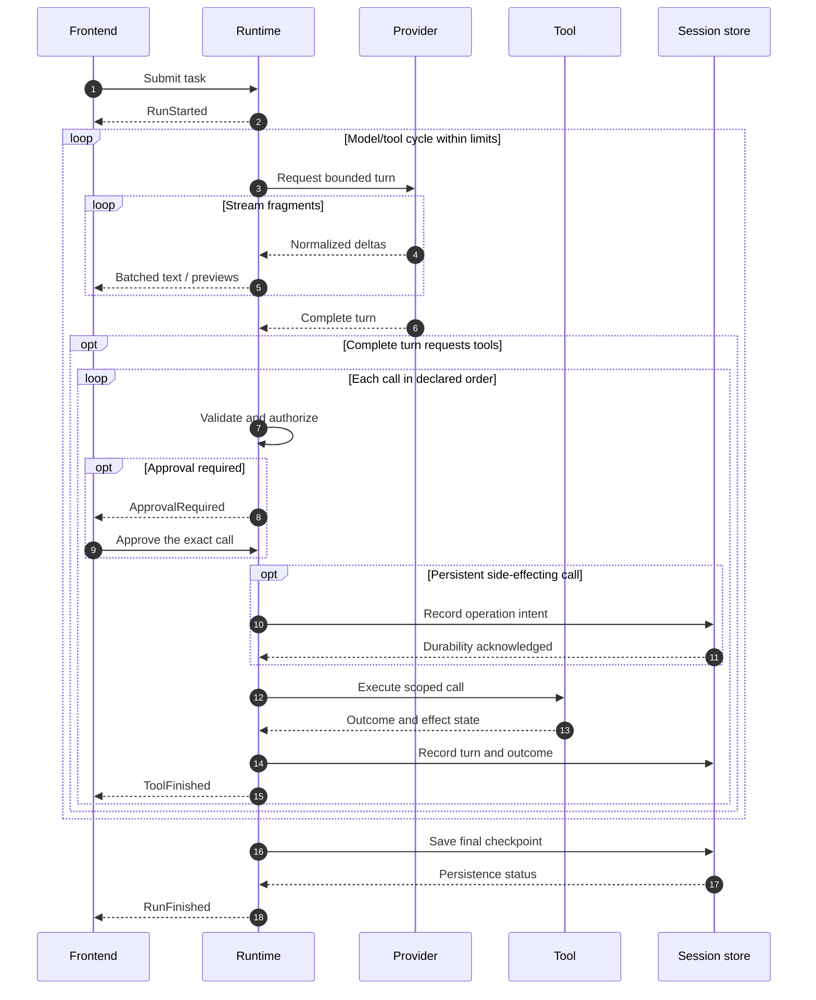

# Nexus Agent

**Fast to start. Small by design. Open to extension.**

A Rust coding agent designed around very fast startup, a minimal core, and a native terminal interface. Broader capabilities belong in replaceable tools and plugins, not an ever-growing engine.

[Documentation](docs/index.md) · [Architecture](#architecture) · [Extensions](#extensions) · [Project status](#project-status)

> [!IMPORTANT]
> Nexus Agent is currently in the **design and contract stage**. There is no Rust workspace, runnable agent, installable release, or benchmark result yet. The diagrams and capabilities below describe the proposed architecture, not implemented features.

## Design Goals

| Priority | Direction |
| --- | --- |
| **Fast startup** | Target at most **100 ms** to become locally interactive in the first release, then keep reducing it. |
| **Small footprint** | Minimize executable size, memory, idle CPU, and background work using measured baselines. |
| **Clear boundaries** | Separate domain logic, execution, integrations, and presentation. |
| **Broad model coverage** | Adapt mainstream protocols without requiring a different SDK for every vendor. |
| **Explicit extensibility** | Support direct Rust tools and cross-language external plugins through narrow contracts. |
| **Linux and macOS first** | Treat both as first-release acceptance platforms; defer Windows. |

The startup target includes local configuration and interface initialization, but not model responses or optional plugin readiness. It is a goal for documented reference environments, **not a measured result or a guarantee on arbitrary hardware**. See the [performance design](docs/design/05-performance.md).

## Architecture

The proposed host runs in one process. Its core, runtime, frontends, and adapters are in-process components; external plugins run separately. Built-in tools do not pay an IPC cost.

Connections show runtime interactions and domain usage, **not source-code dependency direction**. The composition root injects concrete adapters; the runtime does not import their implementations. These are logical components, not fixed crate names or separate background services.

- **Domain core:** portable data, state transitions, and contracts; no terminal, HTTP, vendor SDK, or OS-specific types.
- **Runtime:** authoritative run state, execution limits, authorization, cancellation, and ordered events.
- **Adapters:** model protocols, coding tools, plugin transports, and persistence.
- **Frontends:** input and presentation only; neither the TUI nor headless entry point bypasses runtime policy.

See [component boundaries](docs/design/01-components.md) for dependency direction and ownership.

### Agent Execution

The following sequence illustrates an approved, persistent run. Denial, refusal, errors, cancellation, and uncertain effects have explicit outcomes in the contracts.

Partial tool arguments are previews, never executable instructions. The proposed baseline has one active run and sequential tool dispatch. Cancellation is not rollback, and uncertain side effects must not be blindly replayed.

## Extensions

Built-in and external tools share one semantic contract, but do not share the same transport cost.

| Path | Integration | Tradeoff |
| --- | --- | --- |
| **Built-in Rust tools** | Compiled modules registered through the tool port | Direct calls, no IPC; implementation changes require rebuilding. |
| **External plugins** | Separate programs connected through an adapter | Any language implementing a supported protocol; additional process and serialization overhead. |

MCP over stdio is the preferred initial external-transport candidate, kept outside the domain core. Protocol versions and optional capabilities have not been selected, and **MCP compliance is not currently claimed**.

The initial coding distribution is intended to provide scoped reads, search, patch application, and command execution. Workflow, context selection, storage, and frontend replacement retain explicit boundaries without allowing arbitrary mutation of runtime internals.

**An extensible core does not make every enabled plugin free.** Optional integrations should initialize on demand; heavy dependencies should remain outside the minimal build. Native dynamic-library loading, WASM runtimes, and arbitrary lifecycle hooks are not initial-core goals.

Read the [plugin design](docs/design/04-tool-plugins.md) and [tool contract](docs/contracts/02-tool.md).

## Planned Model Coverage

Coverage is organized by protocol family rather than by a growing list of vendor SDKs.

| Protocol family | Intended integration |
| --- | --- |
| OpenAI Chat Completions-compatible | Compatible hosted services and local endpoints. |
| OpenAI Responses | Responses streaming, function calls, and continuation state. |
| Anthropic Messages | Content blocks, streaming, and tool use/results. |
| Gemini native APIs | Native content/function representations and continuation requirements. |

These are **coverage targets, not verified integrations**. Each adapter must declare capabilities, preserve tool-call identity and required continuation data, and validate its compatibility. A configurable base URL alone does not establish support.

See [model integration](docs/design/03-model-integration.md) and the [provider contract](docs/contracts/01-provider.md).

## Safety and Trust

The proposed runtime enforces permissions, resource scopes, deadlines, and output limits for every execution path. Plugin descriptions and model output are data, not permission grants.

Initial external plugins are explicitly enabled **trusted code**. A subprocess is not a sandbox; isolation for untrusted plugins requires a separate implementation and platform-specific testing. No sandbox or containment guarantee exists today.

See the [security design](docs/design/06-security.md) and [session recovery contract](docs/contracts/04-session-store.md).

## Project Status

- [x] MIT license and confirmed project direction.
- [x] Draft architecture, performance, security, and interface contracts.
- [ ] Review and accept the minimal implementation contracts.
- [ ] Build a testable core/runtime and minimal frontend.
- [ ] Establish Linux and macOS startup and resource baselines.
- [ ] Implement coding tools and mainstream model adapters.
- [ ] Add bounded external-plugin interoperability and session recovery.

Windows and untrusted-plugin isolation are separate follow-up work. There are no installation or build commands yet because no executable implementation exists.

## Documentation and Contributions

Start with the [documentation index](docs/index.md). Proposed implementation work should respect the confirmed direction and review the relevant draft contract before treating it as a stable interface.

| Start here | Purpose |
| --- | --- |
| [Project foundation](docs/design/decisions/00-project-foundation.md) | Confirmed goals and scope. |
| [Overview](docs/design/00-overview.md) | First-release boundaries and non-goals. |
| [Common contract](docs/contracts/00-common.md) | Identifiers, outcomes, errors, limits, and compatibility. |
| [Commands and events](docs/contracts/03-command-events.md) | Frontend/runtime interaction and backpressure. |
| [Configuration](docs/contracts/05-configuration.md) | Profiles, secrets, permissions, and bounded defaults. |
| [Engineering guidelines](AGENTS.md) | Repository working conventions. |

## License

[MIT](LICENSE) · Copyright (c) 2026 Lam K.
