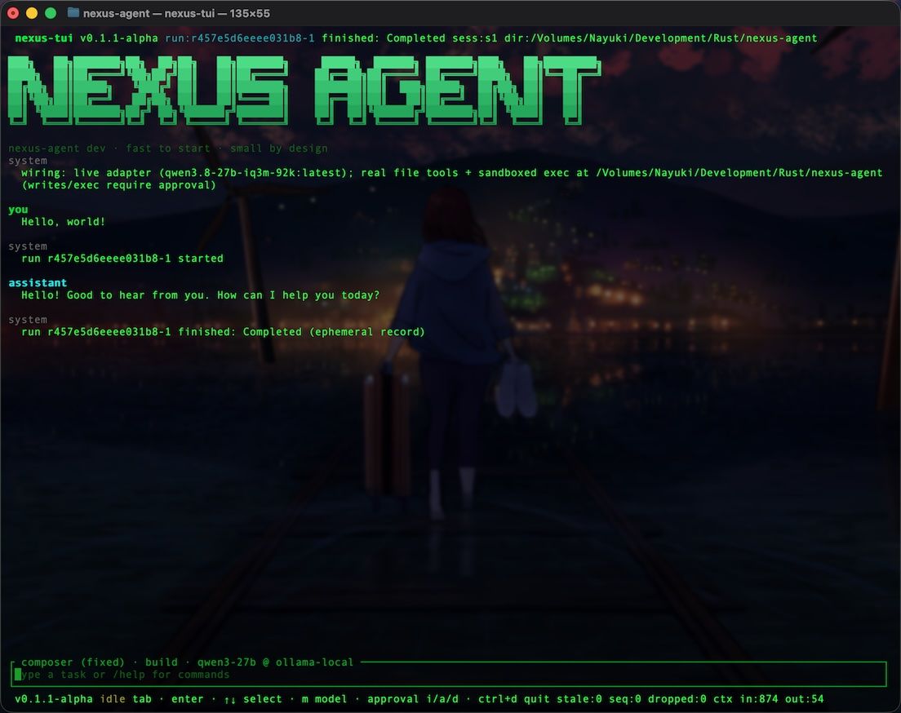
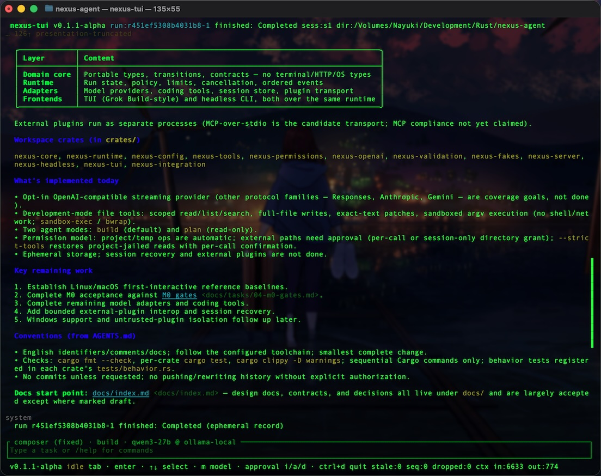
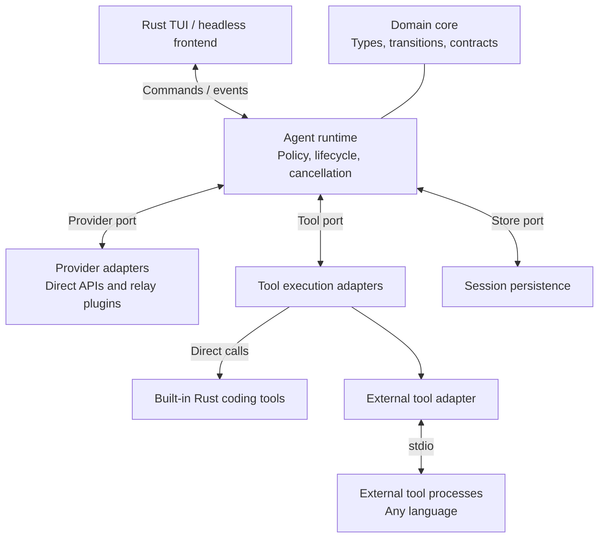
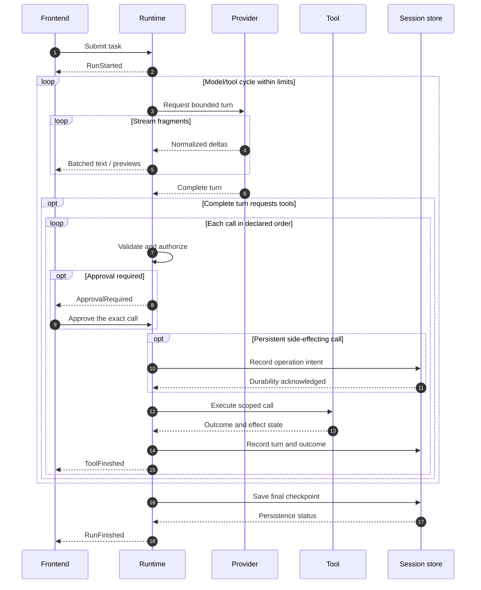

# Nexus Agent

**Fast to start. Small by design. Open to extension.**

[](LICENSE)
[](docs/index.md)

A Rust coding agent designed around very fast startup, a minimal core, and a native terminal interface. Broader capabilities belong in replaceable tools and plugins, not an ever-growing engine.

[Documentation](docs/index.md) · [Architecture](#architecture) · [Extensions](#extensions) · [Project status](#project-status)

Developer checks and optional low-value tests: [Testing](docs/testing.md).

> [!IMPORTANT]
> Nexus Agent has an M0 **test-only implementation** (TUI reports `v0.1.1-alpha`) with opt-in OpenAI-compatible live providers and development-mode file tools plus sandboxed command execution; storage remains ephemeral and plugins are not implemented. Real tools default to development mode: operations inside the project root and temp directories are automatic, access to other paths needs approval (allow once, or grant that directory for the session), and `--strict-tools` restores project-jailed reads with per-call confirmation. See [QUICKSTART.md](QUICKSTART.md) for live wiring and limitations. **M0 acceptance is not complete**. Recorded macOS and Linux (container) runs are historical spawn-to-exit characterization, not first-interactive startup evidence; their RSS results are method-confounded, and PTY, idle-CPU, streaming, buffer high-water, and dispatch baselines are still pending. The diagrams and broader capabilities below describe the proposed architecture, not stable features.

## Screenshots

<div align="center">
<table>
<tr>
<td align="center" width="50%">

<br />
<sub>Title screen — live adapter, sandboxed exec, first reply</sub>
</td>
<td align="center" width="50%">

<br />
<sub>Conversation view — architecture, status, and remaining work</sub>
</td>
</tr>
</table>
</div>

## Design Goals

| Priority | Direction |
| --- | --- |
| **Fast startup** | Target at most **100 ms** to become locally interactive in the first release, then keep reducing it. |
| **Small footprint** | Minimize executable size, memory, idle CPU, and background work using measured baselines. |
| **Clear boundaries** | Separate domain logic, execution, integrations, and presentation. |
| **Broad model coverage** | Adapt mainstream protocols without requiring a different SDK for every vendor. |
| **Explicit extensibility** | Support direct Rust tools and cross-language external plugins through narrow contracts. |
| **Concise code** | Keep normal paths direct, failure paths short, and validation at explicit boundaries. |
| **Linux and macOS first** | Treat both as first-release acceptance platforms; defer Windows. |

The startup target includes local configuration and interface initialization, but not model responses or optional plugin readiness. It is a goal for documented reference environments, **not a measured result or a guarantee on arbitrary hardware**. See the [performance design](docs/design/05-performance.md).

## Architecture

The proposed host runs in one process. Its core, runtime, frontends, and adapters are in-process components; external plugins run separately. Built-in tools do not pay an IPC cost.



Connections show runtime interactions and domain usage, **not source-code dependency direction**. The composition root injects concrete adapters; the runtime does not import their implementations. These are logical components, not fixed crate names or separate background services.

- **Domain core:** portable data, state transitions, and contracts; no terminal, HTTP, vendor SDK, or OS-specific types.
- **Runtime:** authoritative run state, execution limits, authorization, cancellation, and ordered events.
- **Adapters:** model protocols, coding tools, plugin transports, and persistence.
- **Frontends:** input and presentation only; neither the TUI nor headless entry point bypasses runtime policy.

See [component boundaries](docs/design/01-components.md) for dependency direction and ownership.

### Agent Execution

The following sequence illustrates an approved, persistent run. Denial, refusal, errors, cancellation, and uncertain effects have explicit outcomes in the contracts.



Partial tool arguments are previews, never executable instructions. The proposed baseline has one active run and sequential tool dispatch. Cancellation is not rollback, and uncertain side effects must not be blindly replayed.

## First-Release Defaults

Accepted in [Decision 01](docs/design/decisions/01-first-release-defaults.md); detailed interfaces remain drafts.

| Area | Accepted default |
| --- | --- |
| Permissions | Development mode by default: project/temp operations are automatic, external file access needs approval (allow once or a session-only directory grant); `--strict-tools` keeps project-jailed reads with confirmation for mutations and exec. |
| Frontend | Grok Build-style full-screen Rust TUI plus a headless entry point over the same runtime. |
| Sessions | Save automatically outside the project; start new and restore history only on explicit request. |
| Authentication | API configuration with external credential references; browser login deferred. |
| API relay | Relay is a provider plugin; support existing services first and keep local execution optional. |

## Using the Frontends

Both frontends submit to the same runtime, so policy is identical wherever you invoke it. The read-only mode is enforced at tool dispatch, not by convention.

### Agent modes

| Mode | Tool policy |
| --- | --- |
| `build` (default) | Full capability; in development mode project/temp operations are automatic while external paths need approval, and `--strict-tools` requires explicit approval for mutations and exec. |
| `plan` | Read-only: confirmation-required tools are denied without prompting; automatic reads still run. |

In the TUI, `Tab` in the composer cycles modes, and the composer border color and title name the active one. One-shot headless runs take `--mode plan|build|<custom>`. Further modes come from configuration:

```json
{
  "modes": [{ "id": "review", "label": "Review", "read_only": true }],
  "default_mode": "review"
}
```

Built-in ids cannot be redefined, and unknown mode ids or dangling defaults fail explicitly instead of falling back silently.

### TUI presentation

Assistant messages render a Markdown subset (headings, emphasis, code, lists, quotes, tables, footnotes, math) with breathing room between blocks, and CJK text wraps by cell width. Tool cards show the exact invocation with the last 10 output lines and expand on click; entry titles are role-colored. The composer has a blinking block caret that overlays text (`Left`/`Right` move it, `Up`/`Down` recall history), and mouse folding is click-only so arrows never disturb the draft. Left-drag selects conversation or composer text and releasing copies it to the clipboard (OSC 52, which most terminals honor); the wheel scrolls, and `Esc` steps back without ever cancelling. `/help` lists the keys and slash commands.

## Extensions

Built-in and external tools share one semantic contract, but do not share the same transport cost.

| Path | Integration | Tradeoff |
| --- | --- | --- |
| **Built-in Rust tools** | Compiled modules registered through the tool port | Direct calls, no IPC; implementation changes require rebuilding. |
| **External plugins** | Separate programs connected through an adapter | Any language implementing a supported protocol; additional process and serialization overhead. |

MCP over stdio is the preferred initial external-tool transport candidate, kept outside the domain core. Protocol versions and optional capabilities have not been selected, and **MCP compliance is not currently claimed**.

API relay is separate from tool plugins: a relay is a provider implementation behind the provider port, not a model-invoked tool. Existing relay services come first; local relay execution remains an optional boundary and never mandatory startup work.

The initial coding distribution provides scoped reads, listing, and search, full-file writes, exact-text patches, and sandboxed `argv` execution without a shell or network access (`sandbox-exec` on macOS, `bwrap` on Linux). In development mode project/temp operations are automatic and external paths are approval-gated; `--strict-tools` restores per-call confirmation for every mutation and execution. Workflow, context selection, storage, and frontend replacement retain explicit boundaries without allowing arbitrary mutation of runtime internals.

**An extensible core does not make every enabled plugin free.** Optional integrations should initialize on demand; heavy dependencies should remain outside the minimal build. Native dynamic-library loading, WASM runtimes, and arbitrary lifecycle hooks are not initial-core goals.

Read the [plugin design](docs/design/04-tool-plugins.md) and [tool contract](docs/contracts/02-tool.md).

## Planned Model Coverage

Coverage is organized by protocol family rather than by a growing list of vendor SDKs.

| Protocol family | Intended integration |
| --- | --- |
| OpenAI Chat Completions-compatible | Implemented with streaming over HTTP/HTTPS (local endpoints and hosted services). |
| OpenAI Responses | Responses streaming, function calls, and continuation state. |
| Anthropic Messages | Content blocks, streaming, and tool use/results. |
| Gemini native APIs | Native content/function representations and continuation requirements. |

The remaining rows are **coverage targets, not verified integrations**. Each adapter must declare capabilities, preserve tool-call identity and required continuation data, and validate its compatibility. A configurable base URL alone does not establish support.

First-release authentication uses API profiles with external credential references. Existing relay services integrate as provider plugins; local relay execution is optional and on demand.

See [model integration](docs/design/03-model-integration.md), [API relay](docs/design/08-api-relay.md), and the [provider contract](docs/contracts/01-provider.md).

## Safety and Trust

The proposed runtime enforces permissions, resource scopes, deadlines, and output limits for every execution path. Plugin descriptions and model output are data, not permission grants.

Initial external plugins are explicitly enabled **trusted code**. A subprocess is not a sandbox; isolation for untrusted plugins requires a separate implementation and platform-specific testing. No sandbox or containment guarantee exists today.

The default permission policy and session behavior are accepted; automatic access remains scoped to the project/temp boundary, external paths require exact-call confirmation (once, or a session-only directory grant that never persists), strict mode confirms every mutation and execution, and restored history never replays operations or old grants.

See the [security design](docs/design/06-security.md) and [session recovery contract](docs/contracts/04-session-store.md).

## Project Status

- [x] MIT license and confirmed project direction.
- [x] Draft architecture, performance, security, and interface contracts.
- [x] First-release defaults for permissions, TUI, sessions, entry points, authentication, relay scope, and code simplicity.
- [x] Review and accept the minimal implementation contracts ([M0 lock](docs/tasks/06-m0-lock.md)).
- [x] Build a testable core/runtime and minimal frontend (scripted fakes plus opt-in live providers and development-mode file tools with sandboxed exec; routine checks are `cargo fmt --check`, per-crate `cargo test`, and `cargo clippy -D warnings`, with the full suite in GitHub Actions on Ubuntu and macOS; see [Testing](docs/testing.md) for the default/optional split).
- [ ] Establish Linux and macOS reference baselines: only historical spawn-to-exit characterization exists, which is not first-interactive startup evidence; RSS results are method-confounded, and PTY, idle-CPU, streaming, buffer high-water, and dispatch measurements are pending.
- [ ] Complete M0 acceptance against the [M0 gates](docs/tasks/04-m0-gates.md). Gates were executed historically, but the acceptance checklist is incomplete and its evidence is under repair pending coordinator review.
- [ ] Complete coding tools and mainstream model adapters (opt-in OpenAI-compatible streaming, file read/list/search/write/patch, and sandboxed execution are implemented; other provider protocols remain pending).
- [ ] Add bounded external-plugin interoperability and session recovery.

Windows and untrusted-plugin isolation are separate follow-up work. Build the M0 test-only binaries with `cargo build --workspace --release` (produces `nexus-headless` and `nexus-tui`); there is no installable release yet.

## Documentation and Contributions

Start with the [documentation index](docs/index.md). Proposed implementation work should respect the confirmed direction and review the relevant draft contract before treating it as a stable interface.

| Start here | Purpose |
| --- | --- |
| [Project foundation](docs/design/decisions/00-project-foundation.md) | Confirmed goals and scope. |
| [First-release defaults](docs/design/decisions/01-first-release-defaults.md) | Accepted permissions, UI, sessions, entry points, authentication, relay scope, and code simplicity. |
| [TUI and headless frontends](docs/design/07-tui.md) | Grok Build-style layout, approvals, history, and script entry point. |
| [API relay](docs/design/08-api-relay.md) | Relay provider plugins and existing-service/local-executor boundaries. |
| [Implementation readiness](docs/design/09-implementation-readiness.md) | Engineering gates, M0 acceptance, and concise-code review. |
| [Overview](docs/design/00-overview.md) | First-release boundaries and non-goals. |
| [Common contract](docs/contracts/00-common.md) | Identifiers, outcomes, errors, limits, and compatibility. |
| [Commands and events](docs/contracts/03-command-events.md) | Frontend/runtime interaction and backpressure. |
| [Configuration](docs/contracts/05-configuration.md) | Profiles, secrets, permissions, and bounded defaults. |
| [Engineering guidelines](AGENTS.md) | Repository working conventions. |

## License

[MIT](LICENSE) · Copyright (c) 2026 Lam K.
