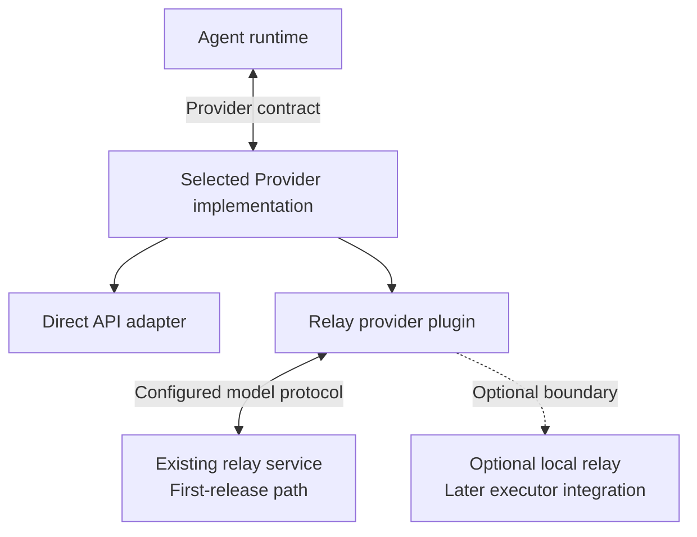

# API Relay Provider Plugins

Status: Draft design. Existing-service integration first and optional local-relay extensibility are accepted in [Decision 01](decisions/01-first-release-defaults.md); neither is implemented.

## Boundary

A relay is a provider integration, not a tool advertised to the model. The core submits a normalized model request and consumes the provider stream regardless of whether the selected implementation talks directly to a vendor or through a relay.

The diagram shows alternative integrations, not automatic fallback or simultaneous forwarding. Provider implementations are injected; the runtime does not import relay-specific clients or routing logic.

## Existing Services First

Register a relay provider profile with its endpoint, selected protocol/model mapping, capability overrides, and its own credential reference. Reuse shared protocol and HTTP infrastructure rather than creating a vendor SDK or subprocess for every relay endpoint.

Endpoint configuration is not proof of protocol compatibility. Validate streaming, tool calls, usage/error handling, and continuation fidelity against the declared capabilities. Unsupported features must fail explicitly rather than degrade into unvalidated tool instructions.

Do not automatically discover endpoints, contact every configured relay, or start local processes during startup.

## Optional Local Relay

Keep a provider/executor boundary for later in-process implementations or separately managed local relay programs. Their purpose may include routing, forwarding, or protocol conversion, but they must obey the same cancellation, limits, identity, and outcome semantics.

Local execution is not a first-release requirement. Any eventual process starts only when explicitly enabled and needed, with bounded lifecycle and cleanup. It cannot become a mandatory daemon or a hidden source of startup work.

A Rust implementation can register through the provider port. Other languages need an explicitly supported HTTP or versioned process protocol; a Rust trait is not a cross-language ABI. MCP's external-tool transport is not a substitute for a provider-plugin protocol.

## Credentials and Privacy

Give each relay only its explicitly configured credentials. Do not forward another profile's vendor key or all host environment variables by default. Endpoint or routing changes require revalidation of destination, credential scope, and compatibility.

A relay receives the authorized model context and may observe sensitive conversation data. Make its identity visible in the selected profile; do not silently switch to it, send context to additional destinations, or log credentials and full request bodies.

## Streaming and Routing

Preserve tool-call references, finish reasons, opaque continuation data, and truthful usage/error states. Cancellation and resource limits remain authoritative even when a relay buffers or transforms the response.

Routing and retry decisions must not silently combine separate attempts, replay host-executed calls, or drop protocol-required state. If an outcome is uncertain, report it. Automatic multi-endpoint failover is not part of the initial relay scope.

## Required Tests

Use local fake endpoints for fragmented output, malformed calls, capability mismatch, cancellation, continuation round trips, and credential isolation. Verify unused profiles perform no network or process initialization. Live relay tests are explicit opt-in operations and must identify their tested scope.

## Related Documents

- [Model integration](03-model-integration.md)
- [Provider contract](../contracts/01-provider.md)
- [Configuration](../contracts/05-configuration.md)
- [Security](06-security.md)
