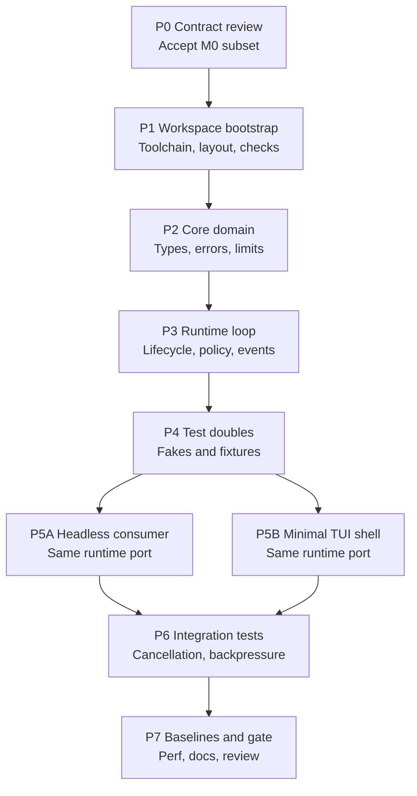

# Phase 1 Pipeline

Status: Draft pipeline. Stage names are scheduling labels, not crate or binary names.

## Pipeline

P5A and P5B are the only parallel implementation lanes. All other stages are sequential gates.

## Stage Contracts

| Stage | Input | Output | Gate |
| --- | --- | --- | --- |
| P0 | Draft contracts `00`–`05`, readiness M0 list | Accepted M0 semantic subset and open-item list | Main agent records what M0 relies on; unresolved details stay out of M0. |
| P1 | Toolchain choice | Buildable workspace with `fmt`, `clippy`, `test` | Clean checks on Linux and macOS; no heavy dependencies. |
| P2 | P0 subset | Core types with no terminal, HTTP, SDK, or OS handles | Unit tests for identities, bounds, errors, and limits. |
| P3 | P2 ports | Single-run loop with validation, approvals, deadlines, cancellation, ordered events | Fake-driven tests; no execution from partial calls. |
| P4 | P2–P3 ports | Deterministic fake provider/tool plus malformed, truncated, and limit fixtures | Covers split frames, duplicate references, refusals, and continuation identity. |
| P5A | P3 handle | Headless task submission with structured results and separate diagnostics | Denies confirmation-required calls without a handler; no terminal init. |
| P5B | P3 handle | Fixed composer, bounded viewport, folding, approval view, controlled refresh | No second policy path; terminal state always restored. |
| P6 | P3–P5 | Backpressure, slow-consumer, disconnect, stale-run, and duplicate-approval tests | Bounded buffers; control stays responsive under output load. |
| P7 | All artifacts | Baselines, updated docs, and M0 decision | Startup, size, memory, CPU, and dispatch evidence on both platforms. |

## File Ownership

Assign disjoint paths per active slice, for example:

- Core slice: core types, errors, limits.
- Runtime slice: loop, policy enforcement, command/event ordering.
- Doubles slice: fakes, fixtures, synthetic streams.
- Headless slice: composition root and headless consumer.
- TUI slice: presentation state and rendering only.

Shared contract files change only through the main agent after P0. Subagents propose contract deltas as review notes, not direct edits.

## Scheduling Rules

- Do not start P3 until P2 ports compile and unit tests pass.
- Do not start P5A/P5B until the runtime command/event handle is stable.
- Merge P5A/P5B through the main agent before P6; resolve ordering and snapshot semantics once.
- Keep M0 offline: no endpoint probing, credential resolution, plugin launch, or repository indexing in any stage.
- Stop the pipeline on a failed gate. Fix the owning slice; do not add fallback branches to bypass the gate.

## Related Documents

- [Overview](00-overview.md)
- [Workflow](02-workflow.md)
- [Subagents](03-subagents.md)
- [M0 gates](04-m0-gates.md)
- [Components](../design/01-components.md)
- [Execution](../design/02-execution.md)
