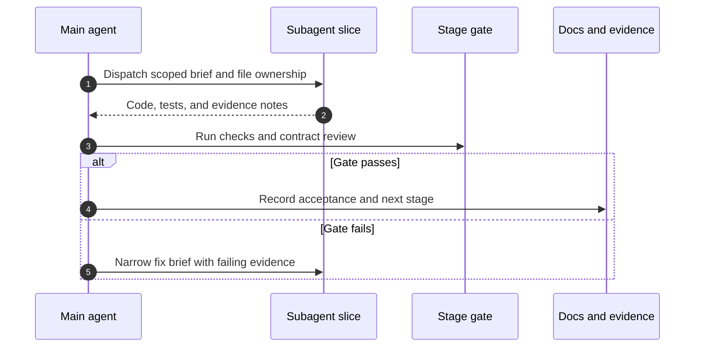

# Phase 1 Workflow

Status: Draft orchestration. The main agent schedules; subagents execute bounded slices.

## Master Loop

Each dispatch states goal, non-goals, allowed paths, relevant contracts, tests to add or update, and the exact evidence to return. A slice is done only when its gate passes.

## Stage Workflow

### P0 Contract review

1. Main agent freezes the M0 semantic subset: identifiers, outcomes, limits, approval binding, stale-run rejection, and headless denial.
2. `explore` checks cross-document consistency and lists conflicts or missing semantics.
3. Main agent records accepted semantics and defers the rest. No code starts until this note exists.

### P1 Workspace bootstrap

1. Main agent selects the toolchain and minimal crate/module split.
2. One `general` slice creates the workspace, formatting, lint, and test configuration.
3. Main agent runs `cargo fmt`, `cargo clippy`, and `cargo test` on Linux and macOS before opening P2.

### P2–P4 Core path

1. Core slice implements domain types and error/limit handling.
2. Runtime slice implements the single-run loop against those ports.
3. Doubles slice adds fake provider/tool behavior and synthetic fixtures.
4. Main agent integrates in P2 → P3 → P4 order and rejects dependency inversions, shared mutable state, or terminal/HTTP leakage into the core.

### P5 Parallel frontends

1. Dispatch P5A and P5B only after the runtime handle and event ordering are stable.
2. Headless slice owns composition and structured output separation.
3. TUI slice owns presentation, bounded viewport work, and terminal cleanup.
4. Neither slice duplicates authorization or execution logic. Main agent merges both before P6.

### P6 Integration

1. One slice adds cancellation, backpressure, slow-consumer, disconnect, duplicate-approval, and stale-event tests.
2. Main agent requires failing-first evidence for at least cancellation under load and stale-run rejection, then the passing run.

### P7 Baselines and close

1. One slice builds the deterministic perf harness: startup, dispatch overhead, streaming throughput, buffer high-water marks, and cancellation latency.
2. Main agent records methodology, hardware, build profile, and both-platform results.
3. Update implementation status and limitations; mark M0 accepted or list blocking items.

## Handoff Format

Every subagent returns:

- Changed paths and test names.
- Commands run with results.
- Contract deviations proposed, if any, as review notes.
- Known limitations and follow-ups.

The main agent verifies dependency direction, concise control flow, bounded resources, and truthful outcomes before advancing.

## Related Documents

- [Pipeline](01-pipeline.md)
- [Subagents](03-subagents.md)
- [M0 gates](04-m0-gates.md)
- [Implementation readiness](../design/09-implementation-readiness.md)
